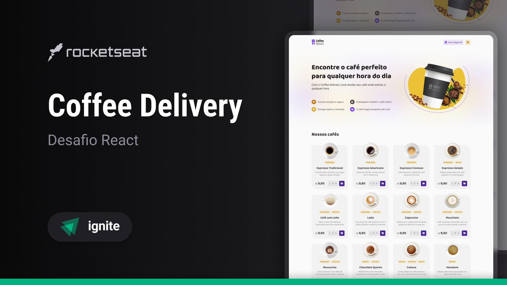
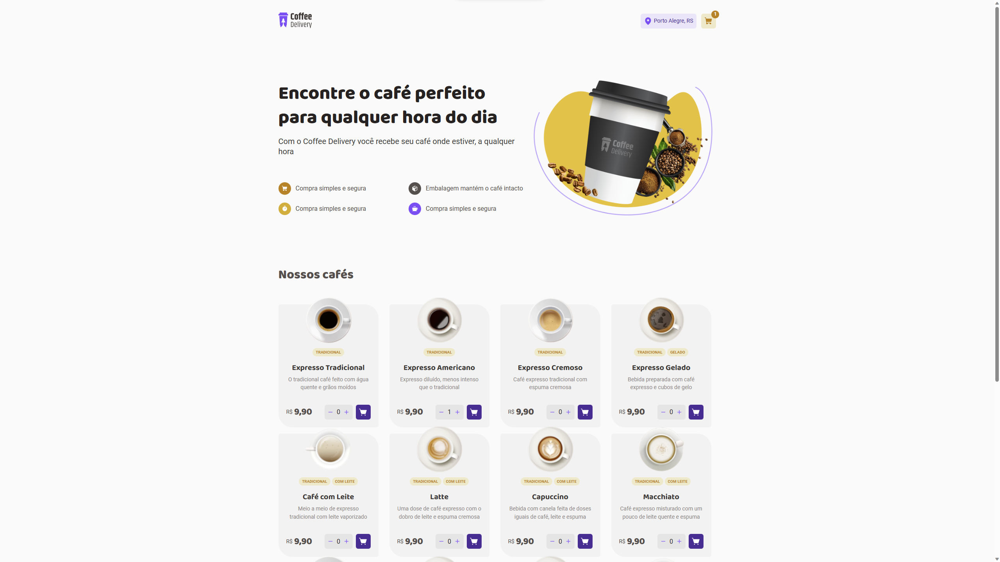
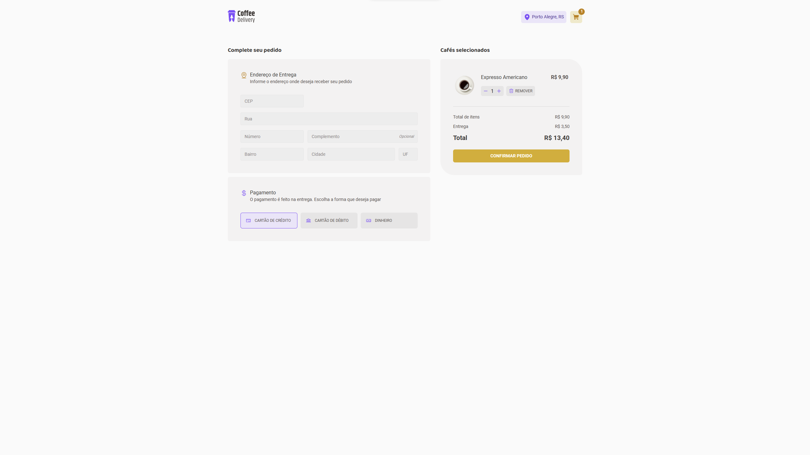
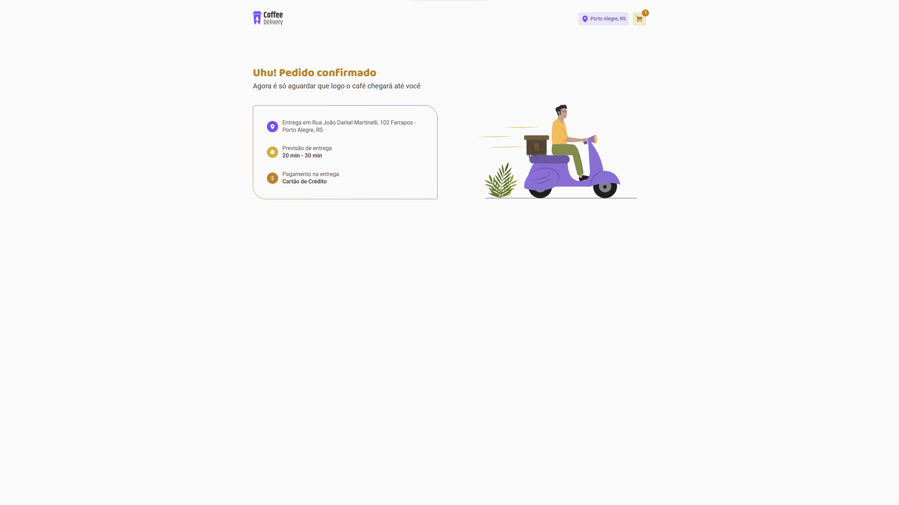

<h1 align="center">
  Ignite Coffee Delivery
</h1>



## 💻 Sobre o projeto

Coffee Delivery é uma página web de catálogo e compra de cafés.
Esse projeto é um dos desafios da trilha de React do Ignite, desenvolvido durante o bootcamp **Ignite de ReactJS** oferecida pela [Rocketseat](https://www.rocketseat.com.br/ignite/).

---

## ⚙️ Funcionalidades

- [x] Listagem de produtos (cafés) disponíveis para compra
- [x] Adicionar uma quantidade específicas de itens no carrinho
- [x] Aumentar ou remover a quantidade de itens no carrinho
- [x] Formulário para o usuário preencher o seu endereço
- [x] Exibir o total de itens no carrinho no Header
- [x] Exibir o valor total da soma de itens no carrinho multiplicados pelo valor

---

## 🎨 Layout

<p align="center" style="display: flex; align-items: flex-start; justify-content: center;">
  

  

  
</p>

---

## 🚀 Como executar o projeto

### Pré-requisitos

Antes de começar, você vai precisar ter instalado em sua máquina as seguintes ferramentas:
[Git](https://git-scm.com), [Node.js](https://nodejs.org/en/).
Além disto é bom ter um editor para trabalhar com o código como [VSCode](https://code.visualstudio.com/)

#### 🧭 Rodando a aplicação web (Frontend)

```bash
# Clone este repositório
$ git clone git@github.com:PedroZago/ignite-reactjs-desafio-01.git
# Acesse a pasta do projeto no seu terminal/cmd
$ cd react-ignite-dashgo
# Instale as dependências
$ yarn
# Execute a aplicação em modo de desenvolvimento
$ yarn dev
# A aplicação será aberta na porta:5173 - acesse http://localhost:5173
```

---

## 🛠 Tecnologias

As seguintes ferramentas foram usadas na construção do projeto:

#### **Website** ([React](https://reactjs.org/) + [TypeScript](https://www.typescriptlang.org/))

- **[Vite](https://vitejs.dev/)**

---

## 📝 Licença

Este projeto esta sobe a licença [MIT](./LICENSE).
